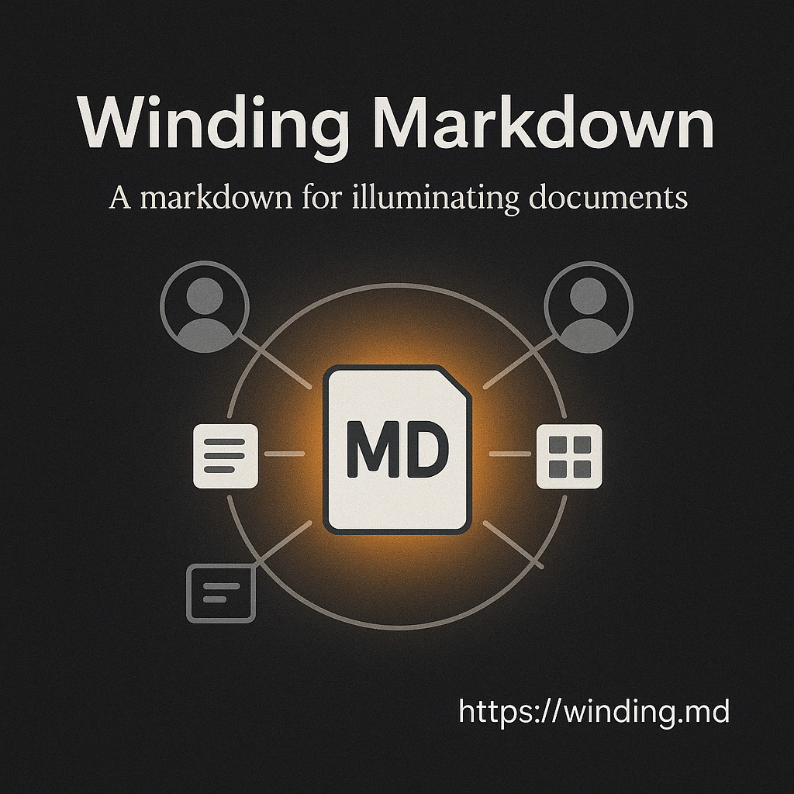

# Winding Markdown (Draft v0.9)
[plain text version](https://winding.md/winding.md)

> A lightweight CommonMark extension for describing layouts, scenes, and images via concise prompts.

## Table of Contents
- [Introduction](#introduction)  
- [Syntax](#syntax)  
- [Syntax Examples](#syntax-examples)  
- [Formal Grammar](#formal-grammar)
- [Philosophy](#philosophy)  

## Introduction

Winding Markdown lets you define slides, scenes , or (https://wind.kids)[complete picture books] using structured, minimal prompts—no long prose required. If you’ve ever struggled with an out of control scene description, this is for you.

To see it in action, here’s a slide example:

```markdown
--
gpt-image-1-winding_markdown: slide, square, jpeg
--
Winding Markdown  
_A markdown for illuminating documents_

@center: image, landscape-orientation
Agents, messages, and layout blocks orbiting a markdown core.

@footer.right:
[https://winding.md](https://winding.md)
```




Or a scene, described in a USD-like way, with a hierarchical structure:

```markdown
--
laptops: image, file, landscape-orientation, png
--
Two laptops, and a phone in the grass. The screen of the phone is dark.

@laptops: modern
Lightly used

@left.screen: 
The dragon, alive, and has green eyes.

@right.screen:
VSCode
```


Winding Markdown effectively decomposes the scene description, into a set of messages to the objects in the scene. These messages are the *prompts* to the *agents* that determine the layout, style and visualization for these objects.


A more realistic example, with a complex scene:


```markdown
--
wind_on_the_grass: image, landscape-orientation, png
style: nwind
--
Two laptops. Wind is lying on the grass, looking at the screen.left. Dappled sunlight through a high oak canopy flickers across his back and the keyboards. His tousled blond hair glows gold with soft iridescence, tiny freckles visible at his temples. A sleek smartphone rests nearby, its glass surface reflecting the green of the trees.

@laptop.left: matte-silver
A Kite logo to the left of the mouse pad.

@laptop.right: smaller, !logo, charcoal-gray

@screen.left:
running a robotics simulation in Omniverse / Isaac Sim.  

@simulation.subject: 
a quadruped metallic dragon in a test harness. Influence: robotic dog, Japanese motorcycle. Wings unfolded, aerodynamic plating, slightly smaller than a hang glider.

@dragon.eyes:
glow bright green — functional HCI, alert despite mechanical constraint.

@screen.right:
VSCode in dark mode, split view with terminals at the bottom, logs streaming and editor pane showing dense motion-control code.

@Wind:
boy, around 8 years old, tousled blond hair, bright blue eyes.

@Wind.pose:
He is lying on his stomach, propped up on his elbows, fingertips poised over the keyboard, slight tension in his wrists. Looking at the laptop, away from the camera, his face is not visible. 

@Wind.clothes:
Teal short-sleeved shirt and charcoal-gray shorts.

@phone:
modern smartphone with a matte-black case, screen dark but glossy, edges catching sunlight.

@trees:
tall oak canopy overhead, leaves filtering light into soft, shifting patterns.

@grass:
lush carpet of individual blades, dew lightly beading near the laptops.
```


## Syntax

### `@identifier:`
Used to **send a message** in the winding to an agent identified by the `@identifier`.

A colon `:` in it is a boundary, it starts a new **space** for the text.  A sign `@` is a decorator, it is not part of the name of the agent, it is used to address the agent.
Multiple identifiers can be used in a single line, preceded by `@`, and separated by spaces or commas.

### `identifiers`, `identifier.other_identifier`
Are used for targeted prompting, this includes free text. Dot notation for precision, used for **targeting** addressing of sub-agents.

### `!identifier`
Used to **invert** the identifier.

In a winding everything is a prompt or a message, and everyhing is an agent. The interpretations of the messages are up to the agents...

### `: layout, style, !something`
Used for example, for **layout, style, or presentation metadata**. Think CSS-like tags. Or talking to that agent to inherit the trait.

### `--` or `:`
A double-dash or column are boundaries, they starts a new **space** for the text.

### `: `
### `Free Markdown Prompting`
Used to talking to that agent to prompt it. The agent is free to interpret the message as it sees fit. The content  can be a Markdown to render, an action to perform, a style to apply, or anything else. A table, mermade diagram or a code block can be used. 


## Syntax Examples

### Typesetting, Spread, Page, Book

An example to illustrate Winding Markdown syntax.  

```markdown
@intro: spread, text  
A spread is a double page, it is usually landscape oriented and this text is a message to the `spread` agent, that by default will print the text.

@page:
A page is a single page, it is usually portrait oriented and this text is a message to the `page` agent, that by default will print the text.
```

### Metadata
```markdown
---
about_metadata: book, portrait-orientation
title: Metadata in Winding Markdown
---
This block is usually present in the beginning of the Winding Markdown file. In this particular case, it is a message to the `about_metadata` agent, that it is a book, and it is portrait oriented. The title is a message to the `title` agent (or more precisely, the `title` agent in the `about_metadata` space, which resolves to `about_metadata.title`), that it is a book about metadata in Winding Markdown.
```

### Object Annotation
```markdown
@laptop:
Modern laptop, lightly used

the description of the laptop is a message to the `laptop` agent, that is in turn a message to *this*, which in this case is the winding.

@screen: 
A dragon, soaring.

@laptop.left.lid:
Kite logo

@dragon.eyes: alive, green
```

Annotation is:
- Context-sensitive — `@screen` in a `@laptop` space assumes containment.
- Objects can be nested mentally, but not structurally.
- Repeated tags are allowed. Order implies visual/topical grouping.


### `: message`
Used for example, for **layout, style, or presentation metadata**. Think CSS-like tags. Or talking to that agent to inherit the trait.

```markdown
@right: page, cutout, square, medium
```

### Images

```markdown
@wind_on_the_grass: image, file, square, png
A summary of the scene. Defaults to camera-level / observer view.
Use `@object` sections to describe focused parts of the image.
```

Alternative syntax, where the winding is defined as a separate block (spatial winding):

```markdown
--
wind_on_the_grass: image, file, square, png
--
A one-paragraph summary of the scene. Defaults to camera-level / observer view.
```

Note: it is allowed to use `wind_on_the_grass.png`, which would then implicitly instantiate `wind_on_the_grass`, by sending a message to its .png agent, but this is not the recommended syntax. The default for the images is currently `png`, to override it, you can send a message to the `image`, subtracting the current default and mixing in the new one:

```markdown
@image: !png, jpeg
```

or include it in the original winding.

#### Image Example - Complex Scene


## Formal Grammar
Formal EBNF Grammar (Lark)

```ebnf
start: (winding | markdown)+

winding: meta_winding | space_winding | inline_winding
meta_winding: "---\n" IDENTIFIER ":" attributes header_winding* "\n---\n" content? 
space_winding: "--\n" IDENTIFIER ":" attributes header_winding* "\n--\n" content?
header_winding: "\n" IDENTIFIER ":" attributes
inline_winding: "@" IDENTIFIER ":" attributes "\n" markdown

content: (inline_winding | markdown)+

markdown: (image | TEXT)+

attributes: (IDENTIFIER ("," IDENTIFIER)*)?

image: "![" CAPTION? "]" "(" URI? ")"

IDENTIFIER: /!?[A-Za-z0-9][ A-Za-z0-9_.-]*/
URI: /[^\)\n]+/
TEXT: /(?:(?!@\w+:|--|!\[).)*\n+/ 
CAPTION: /[^\]]+/
    
%ignore /[ \t]+/
%ignore "\r"  
```


## Philosophy
- No brackets, easy to write by hand, even on a mobile device.
- No indentation rules, no nesting.
- Everything is a message and an agent in a space.
- Compatible with existing Markdown parsers.

Winding Markdown was designed specifically to describe **sequences of scenes**, **agents**, **messages** and **interactions**. We call it interchangebly **Winding Markdown** and `winding.md`. It makes it easier to **illuminate**, to search for a scene that would fit the story, to deal with retroactivity when writing a story, and to create **stable points** and consistent sequences of scenes. 

We call the process of writing in it **winding** and a resulting document a **winding**. It combines storytelling and typesetting. It allows both to write a story, page by page, and leave precise layout messages for the scenes, text, image, and transparent regions. It strikes a balance between plain-text readability and structured design. 

We call a process of searching for a stable point in a winding **illuminating**. It combines typesetting, illustration, and storytelling.


### Spatial Model: Agents and Spaces

Note a **shift** from namespace thinking to **message passing**, and it changes how we mentally model `.winding.md`.

This is a **declarative message system** where:
- Every `@agent:` is a message
- The receiver is contextually defined by the **current space**
- Values are **traits, roles, transformations, or definitions**
- Identity is **relational, not hierarchical**


### Space & Addressing

Every winding (book, page, spread, image...) **defines a space**.

Within a space:
- `@right:` means “send message to `right` agent in this space”
- `@screen.left:` means “send message to agent `screen.left` in this space”
- `@wind.hair:` means “send message to `hair` inside `wind` in this space”

No need to treat these like nested paths (`spread.screen.left`) — it’s more like **contextual dispatch**.

---

### Message Semantics

All `@agent` lines are **sending messages** to an **agent** or *prompting* it.

#### Single role/trait:

```markdown
@right: page
```

→ tells `right` to adopt the trait `page`, to become a `page`.

#### Multiple roles:
```markdown
@right: page, text, centered
```

→ sends 3 messages: “you are a `page`, you are `text`, and you are `centered`”

#### Property setting:
```markdown
@dragon.eyes: green
Alive and functional - HCI.
```

→ sends 2 messages: “you are a `green`” and “you are `Alive and functional - HCI.`” 


### Image Block Revisited, as an Agent
```markdown
@image: wind-on-the-grass.png, cutout, square
I'm just testing, sorry.
This is not defining a new image. It’s sending a message to image, saying:

"Become wind-on-the-grass.png, and take on the traits cutout, square."
Everything that follows in the current space is assumed to talk to that now-transformed image — unless another agent is addressed.

You're speaking to something, not defining it. But you are using true names.
```


### Smalltalk
TODO: turn this into comic strip

It's kind of like if USD, CSS, Smalltalk, Markdown and Python got together on a windy day, and reminiscing GML had taught a trick or two to a new AI kid on the block. 

And then, it is kind of like if Feynman, as if he was there all along, explained state spaces, interactions, retroactivity and stable points to the AI kid really clearly. That when illuminating, messages are like light going over all paths and bouncing off the spatial boundaries, and attenuating. And then they went to fly their dragons, and when they were back, the kid was like, "I get it now! It's like when I fly a dragon, I need to think of all the paths other dragons can take, and how they interact with the wind and the terrain, the clouds and the sun. And dance with them. It's like a dance of information!" And Feynman smiled, knowing that the kid had totally grasped it.


### This

```markdown
--
this : this
--

The Zen of Winding
===

Winding is the source of truth.  
Story, structure, image, and layout  
all emerge from it—and return to it.

Agents speak for themselves.  
You are always in a space.

True names have power.  
Everything is a message.  
Even a page is listening.

Clarity matters more than ceremony.  
Flat doesn’t mean shallow.  
Let things breathe.  
Negative space is part of the story.
```

