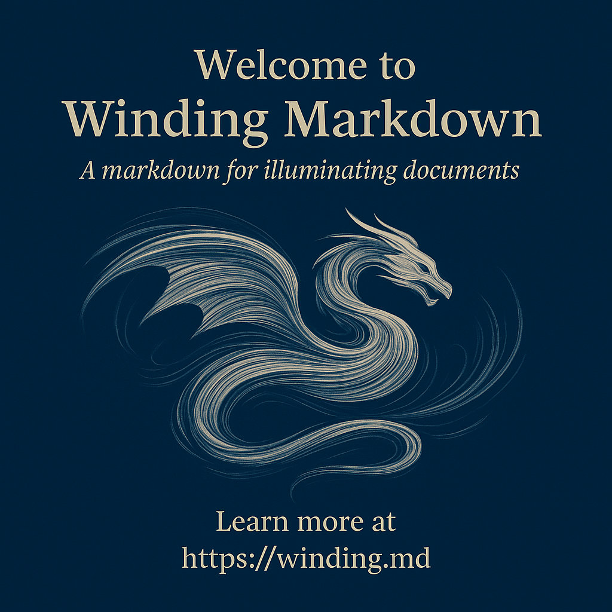
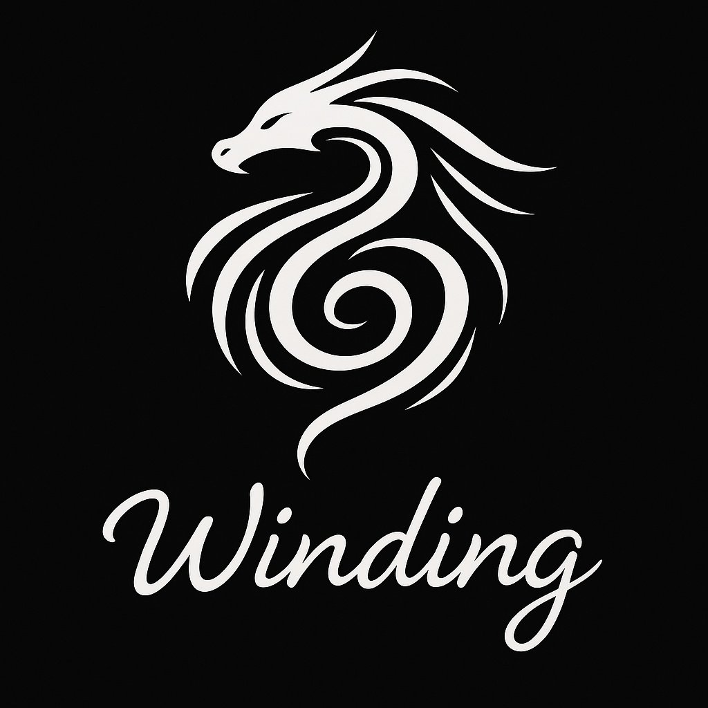
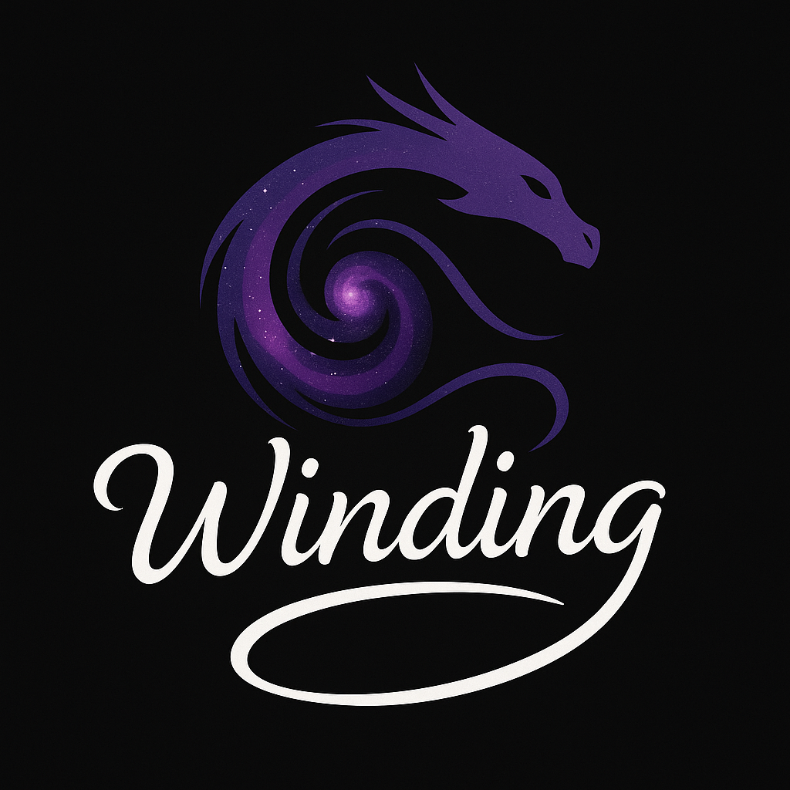
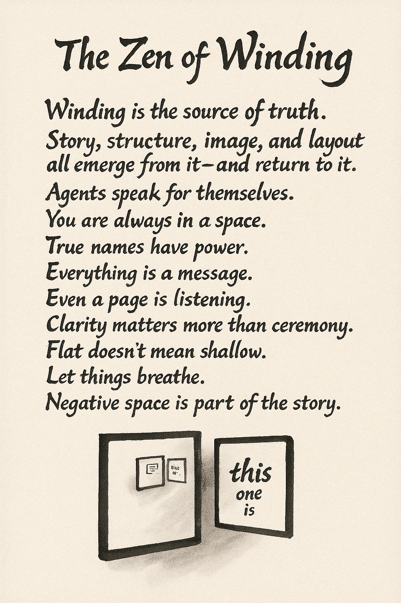

# Winding Markdown (Draft v0.20)
[plain text version](https://winding.md/winding.md) | [pypi module](https://pypi.org/project/winding/) | [Wind for Developers](https://wind.dev) | [Wind for Kids](https://wind.kids) | [GitHub](https://github.com/Wind-WindKids/winding)
<!-- | [Wind Language Foundation](https://wind-lang.org) -->


> A lightweight CommonMark extension for creating artifacts via concise prompts.

## Table of Contents
- [Introduction](#introduction)  
- [Examples of Creating Artifacts](#examples-of-creating-artifacts)
- [Core Concepts](#core-concepts)
- [Syntax Reference](#syntax-reference)  
- [Formal Grammar and AST](#formal-grammar-and-ast)
- [Philosophy](#philosophy)
- [Reference Examples](#reference-examples)
- [This](#this)

## Introduction

Winding Markdown lets you create artifacts, like websites, images, slides, code, or 3D scenes, using structured, minimal prompts. It is a lightweight CommonMark extension that allows you to express and manage *intent* that can be *illuminated* into full implementations. Unlike ephemeral prompts that are lost after generation, Winding Markdown allows you keep your prompts, change them, and align artifacts following these changes.

If you've ever struggled with an out-of-control image prompt, this is for you.

## Quick Start

To see it in action, here’s your first winding:

```markdown
--
my_first_winding: slide, square, jpg
--
Welcome to Winding Markdown  
_A markdown for illuminating documents_

@center: image, wide
A swirl of wind, a flowing text, forming a shape of a dragon.

@footer:
Learn more at  https://winding.md
```

To create an artifact from a winding, you can use the `artifact` command:
```bash
artifact my_first_winding
```

This will create a new artifact from the winding. The artifact will be created in the current directory, and named `my_first_winding.jpg`, that may look like this:



T


## Key Benefits
- **Efficient**: Projects can be [completed in days instead of months](https://wind.kids)
- **Compatible**: Works with any Markdown processor and generative AI tools
- **Readable**: Plain-text format, easy to write even on a mobile
- **Powerful**: Includes [capable](reference/omniverse/big_bang) intent-oriented programming language

## Examples of Creating Artifacts

### Creating a Logo

Winding Markdown is context-aware, allowing you to be *concise* in your descriptions. For example, you can create a logo that matches your first winding with just two lines:

```markdown
@winding.logo: square, abstract, png
A swirl of wind, a flowing text, a galaxy, forming a shape of a dragon.
```




### Creating a Web Page

The same syntax can be used to create a web page, a page of book, or a slide. The only difference is the message to the receiving agent:

```markdown
--
my_first_winding_web_page: jekyll, liquid, file, md
--
Welcome to Winding Markdown  
_A markdown for illuminating documents_

@center: image, square, png, cutout


@footer:
Learn more at  https://winding.md
```


### Creating PDF Files
```markdown
---
files_in_winding_markdown: book, portrait-orientation, file, pdf
---

--
cover
--
Files in Winding Markdown

--
intro: page
--
This is a typical Winding Markdown file, with a meta winding at the beginning, followed by a series of space windings. This particular example is a message to the `files_in_winding_markdown` agent to adopt the traits `book`, `portrait-orientation`, and `file`, which means it will be rendered as a book in portrait orientation, and saved as a PDF file. Further messages will be sent to the space of the `files_in_winding_markdown` agent, which would resolve to `files_in_winding_markdown.cover` and `files_in_winding_markdown.intro` agents. Forming a single page book, with a cover and an introduction.
```

### Creating a Scene

Scenes can be described, with a level of detail that can reach a USD-like description, but without nesting and readable on a mobile device.

```markdown
--
laptops: image, file, landscape-orientation, png
--
Two laptops, and a phone in the grass. The screen of the phone is dark.

@laptops: modern
Lightly used

@left.screen: 
The dragon, alive, and has green eyes.

@right.screen:
VSCode
```


Winding Markdown effectively decomposes the scene description, into a set of prompts or *messages* to the *agents* that are responsible for the layout, style and visualization of the objects in the scene.

Here's a more realistic example, with a more specific description:


```markdown
--
wind_on_the_grass: image, landscape-orientation, png
style: nwind
--
Two laptops. Wind is lying on the grass, looking at the screen.left. Dappled sunlight through a high oak canopy flickers across his back and the keyboards. His tousled blond hair glows gold with soft iridescence, tiny freckles visible at his temples. A sleek smartphone rests nearby, its glass surface reflecting the green of the trees.

@laptop.left: matte-silver
A Kite logo to the left of the mouse pad.

@laptop.right: smaller, !logo, charcoal-gray

@screen.left:
running a robotics simulation in Omniverse / Isaac Sim.  

@simulation.subject: 
a quadruped metallic dragon in a test harness. Influence: robotic dog, Japanese motorcycle. Wings unfolded, aerodynamic plating, slightly smaller than a hang glider.

@dragon.eyes:
glow bright green — functional HCI, alert despite mechanical constraint.

@screen.right:
VSCode in dark mode, split view with terminals at the bottom, logs streaming and editor pane showing dense motion-control code.

@Wind:
boy, around 8 years old, tousled blond hair, bright blue eyes.

@Wind.pose:
He is lying on his stomach, propped up on his elbows, fingertips poised over the keyboard, slight tension in his wrists. Looking at the laptop, away from the camera, his face is not visible. 

@Wind,dragon: eye-contact

@Wind.clothes:
Teal short-sleeved shirt and charcoal-gray shorts.

@phone:
modern smartphone with a matte-black case, screen dark but glossy, edges catching sunlight.

@trees:
tall oak canopy overhead, leaves filtering light into soft, shifting patterns.

@grass:
lush carpet of individual blades, dew lightly beading near the laptops.
```


### Creating a Programming Language
```
---
wind: programming-language, intent-oriented, short
---
@intenting: intent | int | i
@contexting, containing: context | cont | c
@developing: develop | dev | d
@kidding, superalignment: kid | k
@safeproofing,safeguarding: safe | s
@aligning: align | art | a
@artifacting: artifact | art | a
@greyswandiring: greyswandir | g | go | gg | ggg

@s: kidding + superalignment + safeproofing + safeguarding
@a: aligning + artifacting

--
examples
--
a "Hello World!"
align "Hello World!" | artifact
intent "Hello World!" | context "This" | dev "Debug info" | kid | align | artifact
i greyswandir | d | k | s | a ?
@greyswandir: greyswandir | d | k | s | a
@g: greyswandir
gg "Hello World!"


```


```markdown
---
wind: programming-language, intent-oriented
---
@wind: winding.md, grammar, ast, arguments, messages, context, vm, agents, art

@vm: illuminate, winding.md, !illuminate, context, include, output, art

--
messages: arguments, windings
--
@art: illuminate, deluminate, reluminate  
@windings: wind, unwind, draft, dry, wet, kiss, brush, lift, move, fresh, freshen, whirl, heat, cool, whine, whisper  
@context: default, context, include, exclude  
@align: align, safe, help, please, strict, explain, prove, probe, intent, warn, not, question  
@dev: hook, inform, feedback, todo, fix, chat, debug, test
@kids: aloha, kite, fly, run, kid, boy, girl, Wind, Sophie  
```

### Creating a CLI
```markdown
---
wind: programming-language, intent-oriented, operations
---
We define a set of operations on intent here:

--
operations: vm
--
@illuminate:
Creates or updates existing artifact to be aligned with an intent and runs it.

@wind:
Turns artifact into an intent. Adds intent, combining it in.

@unwind:
Removes intent.

@safe:
Safeproofs the intent.

@kid:
Simplifes the intent.

@run:
Executes an existing artifact.

@artifact:
Creates or updates existing artifact to be aligned with an intent.

@measure:
Evaluates against a baseline.

--
examples
--
aloha | illuminate "Hello World!"
```

### Creating 3D Objects
```markdown
@laptop:
Modern laptop, lightly used

the description of the laptop is a message to the `laptop` agent, that is in turn a message to *this*, which in this case is the winding.

@screen: 
A dragon, soaring.

@laptop.left.lid:
Kite logo

@dragon.eyes: alive, green
```

Annotation is:
- Context-sensitive — `@screen` in a `@laptop` space assumes containment.
- Objects can be nested mentally, but not structurally.
- Repeated tags are allowed. Order implies visual/topical grouping.


### Creating Images

```markdown
@wind_on_the_grass: image, file, square, png
A summary of the scene. Defaults to camera-level / observer view.
Use `@object` sections to describe focused parts of the image.
```

Alternative syntax, where the winding is defined as a separate block (spatial winding):

```markdown
--
wind_on_the_grass: image, file, square, png
--
A one-paragraph summary of the scene. Defaults to camera-level / observer view.
```

Note: it is allowed to use `wind_on_the_grass.png`, which would then implicitly instantiate `wind_on_the_grass`, by sending a message to its .png agent, but this is not the recommended syntax. The default for the images is currently `png`, to override it, you can send a message to the `image`, subtracting the current default and mixing in the new one:

```markdown
@image: !png, jpeg
```

or include it in the original winding.


## Creating a Winding from a Winding
By illuminating a winding that outputs a winding, you can create a new winding. This is useful for creating a new winding based on the current context:

```markdown
--
spelling_errors: winding, file, md
--
A winding that contains spelling errors, from the current context, including misspellings inside images.
```

or even creating an agent that can modify itself, if needed:

```markdown
---
spelling_supervisor: winding, file, md
---
A spelling supervisor is a winding that ensures that the spelling is correct in the current context.

--
spelling_errors: winding, file, md
--
A winding that contains spelling errors, from the current context, including misspellings inside images.

--
flagged_windings: winding, file, md
--
A winding that contains flagged winding names with spelling errors.
```


## Core Concepts

Winding Markdown is built on three core concepts:

### 1. **Agents**
Everything in a winding is an agent that can receive messages. An agent could be:
- A layout element (`@center`, `@footer`)
- An object in a scene (`@laptop`, `@dragon`)
- A style, trait or the context (`@style`, `@wide`, `@this`)

### 2. **Messages**
Every line in a winding is a message, prompting some agent:
```markdown
@dragon: green, alive
The dragon soars through clouds.
```
Here, `dragon` receives three messages:
- `green` (trait)
- `alive` (trait)  
- `The dragon soars through clouds.` (description)

### 3. **Spaces**
Spaces are bounded contexts. They determine:
- Which agents are nearby
- How messages propagate
- How much influence context has
- How messages are interpreted

## Syntax Reference

### Quick Reference Table

| Syntax | Purpose | Example |
|---|---|---|
| `@receivers:` | Send message to agent | `@header: bold,centered` |
| `identifier.sub` | Sub-agent | `@laptop.screen: bright` |
| `!identifier` | Negate/remove trait | `@screen: !dark,bright` |
| `:` | Lightweight boundary | `@section:` |
| `--` | Medium boundary | `-- scene: outdoor --` |
| `---` | Strong boundary | `--- document: report ---` |
| `,` | Multiple traits | `@text: bold,italic,large` |

Here are some concise good/poor examples to illustrate naming best practices:

### Naming

#### Poor Naming:
```markdown
---
page1: intro, file, png
---
```
❌ Names the agent after its position (`page1`) rather than purpose

```markdown
--
img3: dragon, landscape
--
```
❌ Generic numbering provides no semantic meaning

```markdown
@obj1: red
@obj2: blue
```
❌ Like naming variables `i1`, `i2` - unclear what these represent

#### Good Naming:
```markdown
---
intro: page, file, png
---
```
✓ Agent name describes what it is

```markdown
--
dragon_flight: image, landscape
--
```
✓ Descriptive name tells you exactly what the image contains

```markdown
@chair: red
@table: blue
```
✓ Clear, semantic names create mental model

#### The Pattern:
- **Poor**: `a1`, `page2`, `img3`, `obj4` (position/order-based)
- **Good**: `intro`, `hello_world`, `front_cover` (purpose/content-based)

Name agents for what they are, not where they appear.

### Syntax

#### `@receivers:`
Used to **send a message** in the winding to agents identified by the `@identifier,[identifier]:` list.

A colon `:` in it is a boundary, it starts a new **space** for the text.  A sign `@` is a decorator, it is not part of the name of the agent, it is used to address the agents.
Multiple identifiers can be used in a single line, preceded by `@`, and separated by commas.

#### `identifier.other_identifier`
Dot notation for precision, used for **targeting** addressing of sub-agents.

#### `!identifier`
Used to **invert** the identifier.

In a winding everything is a prompt or a message, and everyhing is an agent. The interpretations of the messages are up to the agents...

#### `: layout, style, !something`
Used for example, for **layout, style, or presentation metadata**. Think Smalltalk arguments or CSS-like tags. Or talking to that agent to inherit the trait.

#### `---` or `--` or `:`
A triple-dash, double-dash or column are boundaries, they start a new **space** for the text.

#### `Free Markdown Prompting`
Used to talk to that agent to prompt it. The agent is free to interpret the message as it sees fit. The content can be a Markdown to render, an action to perform, a style to apply, or anything else. A table, mermade diagram or a code block can be used. 


### Agent Addressing

```markdown
@agent:              # Direct message to agent
@agent.sub:          # Message to sub-agent
@agent1, agent2:     # Same message to multiple agents
@*:                  # Message to all agents in the current space
```

### Argument Messages

```markdown
@agent: argument1, argument2, !argument3
```
- For example, `@text: bold, illuminated`
- Or to subtract traits, `@text: !italic`

## Boundaries and Context

Boundaries control how context flows between spaces. Think of them as walls with different permeability:

```markdown
: (colon)      → Lightweight boundary (highly permeable)
-- (dash)      → Medium boundary (permeable)  
--- (triple)   → Strong boundary (less permeable)
```

Visual mnemonic: Rotate `:` ninety degrees → `..` → `--` → `---`

### Permeability in Practice

When illuminating a winding, context from surrounding spaces influences the output. The boundary strength determines this influence:

#### Strong Boundary (File, Meta Winding)
```markdown
---
report: document, formal, pdf
---
Quarterly Financial Report
```
- Used at file beginning
- Establishes document-level context
- Less influenced by external context

#### Medium Boundary (Section, Space Winding)
```markdown
--
chart: visualization, data
--
Revenue by quarter...
```
- Creates distinct sections
- Moderate context flow

#### Light Boundary (Local, Inline Winding)
```markdown
@note: aside, italic
Market conditions were favorable.
```
- Minimal separation
- Maximum context influence
- Quick annotations

## Formal Grammar and AST
### EBNF Grammar (Lark)

```ebnf

start: (winding | markdown)+

winding: meta_winding | space_winding | inline_winding
meta_winding: "---\n" receivers ":" arguments header_winding* "\n---\n" windings? 
space_winding: "--\n" receivers ":" arguments header_winding* "\n--\n" windings?
header_winding: "\n" receivers ":" arguments
inline_winding: "@" receivers ":" arguments "\n" markdown

windings: (inline_winding | markdown)+
markdown: (image | TEXT)+
image: "![" CAPTION? "]" "(" URI? ")"

receivers: IDENTIFIER ("," IDENTIFIER)*
arguments: (IDENTIFIER ("," IDENTIFIER)*)?


IDENTIFIER: /!?[A-Za-z0-9][ A-Za-z0-9_.-]*/
URI: /[^\)\n]+/
TEXT: /(?:(?!@\w+[A-Za-z0-9_.,-]*:|--|!\[).)*\n+/ 
CAPTION: /[^\]]+/
    
%ignore /[ \t]+/
%ignore "\r"  
```

### AST
```python
@dataclass
class Image:
    caption: str = field(metadata={"description": "Image caption."})
    url:     str = field(metadata={"description": "Image URL."})

@dataclass
class Markdown:
    content: Union[str, 'Markdown', Image] = field(
        metadata={"description": "Plain text, nested Markdown, or Image node."}
    )

@dataclass
class Winding:
    receivers: List[str] = field(
        default_factory=lambda: ["this"],
        metadata={"description": "The @at receivers list, identifies recipient agents."}
    )
    arguments: List[str] = field(
        default_factory=list,
        metadata={"description": "Arguments: messages like size, orientation, !negation."}
    )
    windings:    List[Union[Markdown, 'Winding']] = field(
        default_factory=list,
        metadata={"description": "Windings: messages with free text or windings."}
    )
```

### AST Object Example
```markdown
---
dragon.portrait: image, character_art, jpg, wide
quality: high
---
Wise eyes.
```

turns into:  

```python
Winding(receivers=['this'], arguments=[], windings=[
    Winding(receivers=['dragon.portrait'],
            arguments=['image', 'character_art', 'jpg', 'wide'],
            windings=[
                Winding(receivers=['quality'], arguments=['high']),                                        
                Markdown(content='Wise eyes.\n')
                ])])
```


## Philosophy
Winding Markdown was originally designed to make a picture book. And easy enough to understand that a 6-year-old could do it in a chat app.

- No brackets, easy to write by hand, even on a mobile device.
- No indentation rules, no nesting.
- Compatible with existing Markdown.

### Spatial Thinking
Traditional markup is hierarchical. Winding is spatial.
In a hierarchy, book > chapter > page > paragraph creates rigid parent-child relationships.
In Winding's spatial model:

- Every winding defines a space
- Agents exist within spaces, not under them
- Messages travel through space to reach agents
- Boundaries control how much context flows between spaces

This matches how we naturally think about scenes and layouts—as spaces where things happen, not as nested containers.

### Intent-Oriented Programming

Winding represents a shift from **imperative** (how to do it) to **declarative intent** (what should exist):

**Traditional Programming**: Describe the steps
```javascript
// 500 lines of boilerplate code
function init() {
    // Initialize grid, set up event listeners, etc.
    // ...
}
```

**Winding Markdown**: Describe the intent

```markdown
---
game_of_life: web, file, html, css, js
---
Conway's classic, but make it beautiful.

@grid: 50x50, wraparound
@cells: organic, bioluminescent
@controls: play, pause, step, clear, random
@style: dark-mode, neon-accent
```

### Designed for Art
Winding was designed specifically to create art. It makes it easier to:

- **Deal with retroactivity:** Adjust earlier scenes based on later developments
- **Create stable points:** Maintain consistency across sequences
- **Combine mediums:** Unite storytelling and setting into medium in one format

We call the process of writing in it **winding** and a resulting document a **winding**. It allows both to write a story, page by page, and leave precise layout messages for the scenes, text, image, and transparent regions. It strikes a balance between plain-text readability and structured design. 

We call a process of searching for a stable point in a winding **illuminating**. It combines typesetting, illustration, and storytelling.


## Reference Examples
- [Hello World](reference/hello_world/)
- [My First Winding Web Page](reference/my_first_winding/)
- [Smalltalk](reference/smalltalk/)
- [Image Block Revisited](reference/image_block_revisited.md)
- [Fred's 14 Points of Animation Supervisor](reference/fred/winding.md)

## This

```markdown
--
this : this
--

The Zen of Winding
===

Winding is the source of truth.  
Story, structure, image, and layout  
all emerge from it—and return to it.

Agents speak for themselves.  
You are always in a space.

True names have power.  
Everything is a message.  
Even a page is listening.

Clarity matters more than ceremony.  
Flat doesn’t mean shallow.  
Let things breathe.  
Negative space is part of the story.
```

