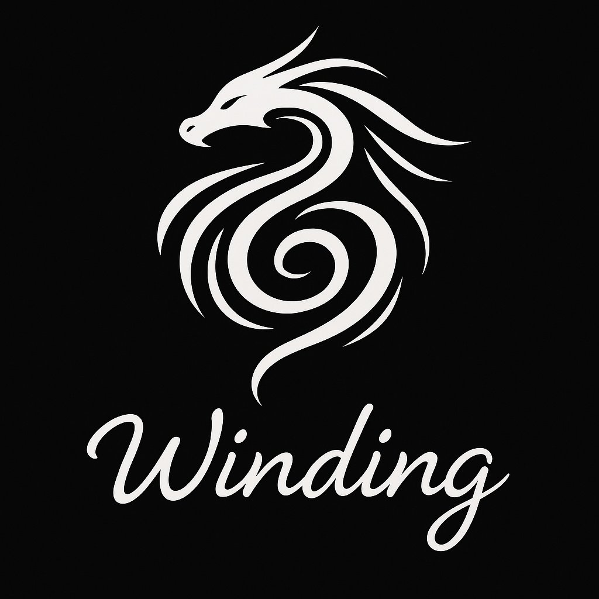

# Winding Markdown (Draft v0.11)
[plain text version](https://winding.md/winding.md)

> A lightweight CommonMark extension for describing layouts, scenes, and images via concise prompts.

## Table of Contents
- [Introduction](#introduction)  
- [Syntax](#syntax)  
- [Syntax Examples](#syntax-examples)  
- [Formal Grammar](#formal-grammar)
- [Philosophy](#philosophy)  

## Introduction

Winding Markdown lets you define web sites, images, slides or 3D scenes using structured, minimal prompts—no long prose required. If you’ve ever struggled with an out of control image prompt, this is for you. 

## Quick Start

To see it in action, here’s your first winding:

```markdown
--
my_first_winding: slide, square, jpg
--
Welcome to Winding Markdown  
_A markdown for illuminating documents_

@center: image, wide
A swirl of wind, a flowing text, forming a shape of a dragon.

@footer:
Learn more at  https://winding.md
```


Initially, with simple images and slides, you don't need specialized tooling. Provide a prompt like this: `Please illuminate this markdown.` and the markdown into [ChatGPT](https://chatgpt.com) or another capapble generative AI.

## Key Benefits
- **Readable**: Plain-text format, easy to write even on a mobile device.
- **Efficient**: A month of work, like writing and typesetting a full illustrated story, can be [compressed into a few evenings](https://wind.kids).
**Compatible**: Compatible with any CommonMark processor, works out of the box with ChatGPT.

With winding markdown, context and existing generations are utilized, this allows for a more *concise* descriptions, for example, a single line can be used to make a logo that would match your first winding: 

```markdown
--
winding_logo: logo, square, png, abstract
--
A swirl of wind, a flowing text, a galaxy, forming a shape of a dragon.
```



## Describing a Scene

Scenes can be described, with a level of detail that can rich a USD-like description, but without nesting and readable on a mobile device.

```markdown
--
laptops: image, file, landscape-orientation, png
--
Two laptops, and a phone in the grass. The screen of the phone is dark.

@laptops: modern
Lightly used

@left.screen: 
The dragon, alive, and has green eyes.

@right.screen:
VSCode
```


Winding Markdown effectively decomposes the scene description, into a set of prompts or *messages* to the *agents* that are responsible for the layout, style and visualization of the objects in the scene.

Here's a more realistic example, with a more specific description:


```markdown
--
wind_on_the_grass: image, landscape-orientation, png
style: nwind
--
Two laptops. Wind is lying on the grass, looking at the screen.left. Dappled sunlight through a high oak canopy flickers across his back and the keyboards. His tousled blond hair glows gold with soft iridescence, tiny freckles visible at his temples. A sleek smartphone rests nearby, its glass surface reflecting the green of the trees.

@laptop.left: matte-silver
A Kite logo to the left of the mouse pad.

@laptop.right: smaller, !logo, charcoal-gray

@screen.left:
running a robotics simulation in Omniverse / Isaac Sim.  

@simulation.subject: 
a quadruped metallic dragon in a test harness. Influence: robotic dog, Japanese motorcycle. Wings unfolded, aerodynamic plating, slightly smaller than a hang glider.

@dragon.eyes:
glow bright green — functional HCI, alert despite mechanical constraint.

@screen.right:
VSCode in dark mode, split view with terminals at the bottom, logs streaming and editor pane showing dense motion-control code.

@Wind:
boy, around 8 years old, tousled blond hair, bright blue eyes.

@Wind.pose:
He is lying on his stomach, propped up on his elbows, fingertips poised over the keyboard, slight tension in his wrists. Looking at the laptop, away from the camera, his face is not visible. 

@Wind.clothes:
Teal short-sleeved shirt and charcoal-gray shorts.

@phone:
modern smartphone with a matte-black case, screen dark but glossy, edges catching sunlight.

@trees:
tall oak canopy overhead, leaves filtering light into soft, shifting patterns.

@grass:
lush carpet of individual blades, dew lightly beading near the laptops.
```

## Describing a Web Page

The same syntax can be used to describe a web page, a page of book, or a slide. The only difference is the message to the responsible agent:

```markdown
--
my_first_winding_web_page: jekyll, liquid, file, md
--
Welcome to Winding Markdown  
_A markdown for illuminating documents_

@center: image, square, png, cutout


@footer:
Learn more at  https://winding.md
```


## Syntax

### `@identifier:`
Used to **send a message** in the winding to an agent identified by the `@identifier`.

A colon `:` in it is a boundary, it starts a new **space** for the text.  A sign `@` is a decorator, it is not part of the name of the agent, it is used to address the agent.
Multiple identifiers can be used in a single line, preceded by `@`, and separated by spaces or commas.

### `identifiers`, `identifier.other_identifier`
Are used for targeted prompting, this includes free text. Dot notation for precision, used for **targeting** addressing of sub-agents.

### `!identifier`
Used to **invert** the identifier.

In a winding everything is a prompt or a message, and everyhing is an agent. The interpretations of the messages are up to the agents...

### `: layout, style, !something`
Used for example, for **layout, style, or presentation metadata**. Think CSS-like tags. Or talking to that agent to inherit the trait.

### `--` or `:`
A double-dash or column are boundaries, they starts a new **space** for the text.

### `: `
### `Free Markdown Prompting`
Used to talking to that agent to prompt it. The agent is free to interpret the message as it sees fit. The content  can be a Markdown to render, an action to perform, a style to apply, or anything else. A table, mermade diagram or a code block can be used. 


## Syntax Examples

### Typesetting, Spread, Page, Book

An example to illustrate Winding Markdown syntax.  

```markdown
@intro: spread, text  
A spread is a double page, it is usually landscape oriented and this text is a message to the `spread` agent, that by default will print the text.

@page:
A page is a single page, it is usually portrait oriented and this text is a message to the `page` agent, that by default will print the text.
```

### Metadata
```markdown
---
about_metadata: book, portrait-orientation
title: Metadata in Winding Markdown
---
This block is usually present in the beginning of the Winding Markdown file. In this particular case, it is a message to the `about_metadata` agent, that it is a book, and it is portrait oriented. The title is a message to the `title` agent (or more precisely, the `title` agent in the `about_metadata` space, which resolves to `about_metadata.title`), that it is a book about metadata in Winding Markdown.
```

### Object Annotation
```markdown
@laptop:
Modern laptop, lightly used

the description of the laptop is a message to the `laptop` agent, that is in turn a message to *this*, which in this case is the winding.

@screen: 
A dragon, soaring.

@laptop.left.lid:
Kite logo

@dragon.eyes: alive, green
```

Annotation is:
- Context-sensitive — `@screen` in a `@laptop` space assumes containment.
- Objects can be nested mentally, but not structurally.
- Repeated tags are allowed. Order implies visual/topical grouping.


### `: message`
Used for example, for **layout, style, or presentation metadata**. Think CSS-like tags. Or talking to that agent to inherit the trait.

```markdown
@right: page, cutout, square, medium
```

### Images

```markdown
@wind_on_the_grass: image, file, square, png
A summary of the scene. Defaults to camera-level / observer view.
Use `@object` sections to describe focused parts of the image.
```

Alternative syntax, where the winding is defined as a separate block (spatial winding):

```markdown
--
wind_on_the_grass: image, file, square, png
--
A one-paragraph summary of the scene. Defaults to camera-level / observer view.
```

Note: it is allowed to use `wind_on_the_grass.png`, which would then implicitly instantiate `wind_on_the_grass`, by sending a message to its .png agent, but this is not the recommended syntax. The default for the images is currently `png`, to override it, you can send a message to the `image`, subtracting the current default and mixing in the new one:

```markdown
@image: !png, jpeg
```

or include it in the original winding.

#### Image Example - Complex Scene


## Formal Grammar
Formal EBNF Grammar (Lark)

```ebnf
start: (winding | markdown)+

winding: meta_winding | space_winding | inline_winding
meta_winding: "---\n" IDENTIFIER ":" attributes header_winding* "\n---\n" content? 
space_winding: "--\n" IDENTIFIER ":" attributes header_winding* "\n--\n" content?
header_winding: "\n" IDENTIFIER ":" attributes
inline_winding: "@" IDENTIFIER ":" attributes "\n" markdown

content: (inline_winding | markdown)+

markdown: (image | TEXT)+

attributes: (IDENTIFIER ("," IDENTIFIER)*)?

image: "![" CAPTION? "]" "(" URI? ")"

IDENTIFIER: /!?[A-Za-z0-9][ A-Za-z0-9_.-]*/
URI: /[^\)\n]+/
TEXT: /(?:(?!@\w+:|--|!\[).)*\n+/ 
CAPTION: /[^\]]+/
    
%ignore /[ \t]+/
%ignore "\r"  
```


## Philosophy
- No brackets, easy to write by hand, even on a mobile device.
- No indentation rules, no nesting.
- Everything is a message and an agent in a space.
- Compatible with existing Markdown parsers.

Winding Markdown was designed specifically to describe **sequences of scenes**, **agents**, **messages** and **interactions**. We call it interchangebly **Winding Markdown** and `winding.md`. It makes it easier to **illuminate**, to search for a scene that would fit the story, to deal with retroactivity when writing a story, and to create **stable points** and consistent sequences of scenes. 

We call the process of writing in it **winding** and a resulting document a **winding**. It combines storytelling and typesetting. It allows both to write a story, page by page, and leave precise layout messages for the scenes, text, image, and transparent regions. It strikes a balance between plain-text readability and structured design. 

We call a process of searching for a stable point in a winding **illuminating**. It combines typesetting, illustration, and storytelling.


### Spatial Model: Agents and Spaces

Note a **shift** from namespace thinking to **message passing**, and it changes how we mentally model `.winding.md`.

This is a **declarative message system** where:
- Every `@agent:` is a message
- The receiver is contextually defined by the **current space**
- Values are **traits, roles, transformations, or definitions**
- Identity is **relational, not hierarchical**


### Space & Addressing

Every winding (book, page, spread, image...) **defines a space**.

Within a space:
- `@right:` means “send message to `right` agent in this space”
- `@screen.left:` means “send message to agent `screen.left` in this space”
- `@wind.hair:` means “send message to `hair` inside `wind` in this space”

No need to treat these like nested paths (`spread.screen.left`) — it’s more like **contextual dispatch**.

---

### Message Semantics

All `@agent` lines are **sending messages** to an **agent** or *prompting* it.

#### Single role/trait:

```markdown
@right: page
```

→ tells `right` to adopt the trait `page`, to become a `page`.

#### Multiple roles:
```markdown
@right: page, text, centered
```

→ sends 3 messages: “you are a `page`, you are `text`, and you are `centered`”

#### Property setting:
```markdown
@dragon.eyes: green
Alive and functional - HCI.
```

→ sends 2 messages: “you are a `green`” and “you are `Alive and functional - HCI.`” 


### Image Block Revisited, as an Agent
```markdown
@image: wind-on-the-grass.png, cutout, square
I'm just testing, sorry.
This is not defining a new image. It’s sending a message to image, saying:

"Become wind-on-the-grass.png, and take on the traits cutout, square."
Everything that follows in the current space is assumed to talk to that now-transformed image — unless another agent is addressed.

You're speaking to something, not defining it. But you are using true names.
```


### Smalltalk

```markdown
--- 
smalltalk: comic, portrait-orientation
---
A comic strip to illuminate retroactive interactions when an author winds a story and changes something in the middle of a text.

@style: nwind, illuminating, hand-drawn, sketchy

@outline: !visible
It's kind of like if USD, CSS, Smalltalk, Markdown and Python got together on a windy day, and reminiscing GML had taught a trick or two to a new kid on the block. 

And then, it is kind of like if Feynman, as if he was there all along, explained state spaces, interactions, retroactivity and stable points to the kid really clearly. That when illuminating, messages are like light going over all paths and bouncing off the spatial boundaries, and attenuating. And then they went to fly their dragons, and when they were back, the kid was like, "I get it now! It's like when I fly a dragon, I need to think of all the paths other dragons can take, and how they interact with the wind and the terrain, the clouds and the sun. And dance with them. It's like a dance of information!" And Feynman smiled, knowing that the kid had totally grasped it.

--
characters: recognizable, gentle, personified
--
Based on most recognizable photos from Wikipedia main pages. Characters wear their usual clothes.

@Markdown: character, image, anchor  
Based on 

@CSS: character, image, anchor  
Based on 

@USD: character, image, anchor  
Based on 

@USD.explanation: !visible  
The Universal Scene Description (USD) was first used internally by Pixar in the film Brave (2012) as part of their Presto system; that movie was “dedicated with love and gratitude to Steve Jobs.”

@Python: character, image, anchor  
Based on 

@Smalltalk: character, image, anchor  
Based on 

@Wind: character, image, anchor  
Based on 

@GML: character, image, anchor  
Based on 

@Feynman: character, image, anchor  
Based on 

--
pages
--
- [A small group, chit-chatting.](pages/the_gathering.md)
- [Nothing like a good chitchat to start the day.](pages/more_chitchat.md)
- [The green dragon transforms into a human, Richard Feynman.](pages/transformation.md)
- [They continue chitchat, now Feynman engaged Wind.](pages/feynman_wind.md)
- [They wait.](pages/they_wait.md)
- [They launch.](pages/takeoff.md)
- [They fly.](pages/dragons.md)
- [Landing the story.](pages/landing.md)
```

```markdown
---
smalltalk_starts: page, portrait-orientation
---
A small group, chit-chatting.

--
the_gathering: panel, wide, large
--
Markdown, CSS, USD, Smalltalk, Python and Wind sit together on a grassy hill, chatting. GML stands nearby, looking at the ridge.

@background: early-morning mist, soft sunlight on grass, a few dragons flying, distant paraglider silhouettes, low to the ground.

--
usd_talking: panel, square
--
USD leans forward, eyes tracing a blue dragon skimming gravel below.

@bubble: text, small, italic  
"Look at that blue dragon—she's catching lift right off the gravel streaks."

@detail:  
Dragon is quite low, barely clearing the hillside tree line. The gravel patch is a mix of light and dark, with some patches glistening in the sunlight.

--
python_reply: panel, wide
--
Python nods thoughtfully, adjusting his scripting gloves.

@bubble:
"Yeah, I see it. She's timing her turns perfectly. I'm not sure I could do that. I'd probably end up in a tree."

--
smalltalk_laughs: panel, square
--
Smalltalk laughs, coffee cup in hand, turning to GML.

@bubble: 
"Remember that time?"

@cup: brown, green, paper
A coffee cup with a kite logo and a travel lid.

--
smalltalk_anecdote: panel, wide
--
@bubble:
"One misplaced bracket and the whole code tree spiraled. I thought I was going to end up in that tree too!"

@background:
A misty cloud over the ridge looks suspiciously like a bracket.

--
markdown_reflection: panel, tall
--
Markdown gazes toward the ridge, at the whispy clouds suddenly appearing and looking suspiciously like brackets.

@markdown.thoughts: cloud, text, small, handwritten  
"Brackets always sneak back in. And in the retrospective, they are nearly always a hazard."
```

```markdown
---
more_chitchat: page, portrait-orientation
---
Nothing like a good chitchat to start the day.

--
smalltalk_points: panel, tall
--
Smalltalk points out the ridge, under the misty clouds that look a bit less like brackets now. The early morning thermal starting to lift gently from the hillside, implying conditions may improve soon.

@bubble:
"Look at those streaks of wind on the grass, on the hillside."

--
wind_impatient: panel, square
--
Wind, clearly anxious to launch, listens impatiently as the adults discuss conditions calmly.

@bubble:
"Yeah, should we launch now? I think I could have caught that one."

@GML.bubble:
"Be patient, Wind. It is still too light. See this green dragon?"

--
green_dragon: panel, wide, large
--
A striking, iridescent green dragon swoops dramatically toward the hilltop, startling the group.

@dragon:
A metallic green dragon, iridescent, with a hint of blue and gold in the sunlight. It's a bit smaller than a hang glider, with a sleek, aerodynamic design. It looks a bit too precise, to be biological, but it is not a drone either. It is a dragon, and it is alive.

--
green_dragon_arrival: panel, square
--
The dragon lands somewhat abruptly, scattering dust and causing slight disarray among gear and group members.
```

```markdown
---
transformation: page, portrait-orientation
---
The green dragon transforms into a human, Richard Feynman.

--
green_dragon_folding_wings: panel, square
--
An emerald-green dragon begins folding its wings.

--
dragon_transformation_starts: panel, square
--
An emerald-green dragon begins folding its wings, wingtips contract as the wings pixelate, fragmenting into quads and pixels.

@transformation: detail, !visible, !text
Human/dragon transforms without menace, casual. Like in Airbender or Luca, but with pixelation. Obviously some advanced nanotech at work there, handling a quick redistribution of matter from an object the size of the hang glider to a human size. But the magic of it is efficient, not flashy and it fades into the background, like good technology should.

--
dragon_transformation_head: panel, square
--
Pixelation and quades cascade from the dragon’s head; a faint human silhouette (Feynman) emerges.

--
dragon_transformation_body: panel, square
--
The body pixelates, flesh and fabric take shape mid-transition. A quad mesh forms the outline of a face.

@transformation: detail, !visible, !text  
Nanotech weaves pixelated iridescent dragon body into skin and clothes seamlessly.

--
dragon_transformation_face: panel, square
--
Feynman’s face emerges from the pixelated quad mesh, slightly angled and amused.

--
feynman_arrival: panel, wide, large
--
Richard Feynman stands where the dragon once was, dusting pixels off himself casually. The group waves, warmly, but nonchalantly.

--
weather_talk: panel, wide
--
Feynman brushes pixel-dust off his jacket, smiling at the group.

@bubble:  
“Very light lift, a lot of flapping. I've barely made it to top-land.”

--
wind_frustration: panel, square
--
Wind, looking a bit frustrated, glances at the GML.
@bubble:
"More waiting?"
```

```markdown
---
feynman_wind: page, portrait-orientation
---
They continue chitchat, now Feynman engaged Wind.

--
feynman_instruction: panel, wide
--
@bubble:
"Wind, pretend you are airborne, scratching the rocks, just above that blue dragon.”

--
wind_looks: panel, square
--
Wind looks at the blue dragon, who is now a lot lower.

--
feynman_looks: panel, square
--
Feynman looks at the blue dragon, as well.
@bubble:
"And retrace how you got there."

-- 
wind_retraces: panel, square, cutout
--
Wind lifts a finger to his lips, thoughtful.

-- 
blue_dragon_flaps: panel, square, cutout
--
The blue dragon, failing to catch any lift beats its wings in short, powerful strokes. The sunlight gleams off its body, pixelated quads are visible, as the dragon adjusts her flying configuration. She is now well below the ridge.

-- 
wind_shifts: panel, square, cutout
--
Wind shifts involuntarily: one hand sliding to his hip while the other floats outward, fingers splayed as if echoing the dragon’s wingbeat. A faint pixelation ripples along his arms and torso, hinting at a draconic form.

-- 
wind_composure: panel, square, cutout
--
Wind catches himself, the pixelation receding as he steadies his stance.

@bubble:
"Oh…"
```

```markdown
---
they_wait: page, portrait-orientation
---
They wait.

-- 
group_bored: panel, wide, cutout
--
The sun climbs slightly higher.

-- 
wind_bored: panel, square, cutout
--
Wind rests his chin on his hand, elbow on knee, staring up at the bright sky.

-- 
python_slumps: panel, square, cutout
--
Python slumps against a rock, eyes half-closed in the glare.

-- 
smalltalk_sighs: panel, square, cutout
--
Smalltalk crosses his arms, as he watches a lone bracket shaped cloud drift by.

-- 
sun_high: panel, wide, cutout
--
The sun now high and glaring, casting short shadows. The trees are now moving, with the breeze gently hugging the terrain.
```

```markdown
---
takeoff: page, portrait-orientation
---
They launch.

-- 
preflight_announce: panel, wide, cutout
--
The group is shifting, some pixelation and quads are visible on the arms. Expressions are no longer bored, faces looking intense. 

@bubble:
"Alright gents preflight checks."

-- 
subvocal_comm: panel, square, cutout
--
@bubble: subvocal
"Everyone loud and clear?"

-- 
thermal_and_sodar: panel, square, cutout
--
A small atmospheric Sodar, consisting of a grid of thin one inch disks is nestling under a windsock, pointing at the ridge. A small antenna is also visible.

@sodar: small, minimalist, plain, cerramic
Based on 

@antenna: small, minimalist, plain, plastic
Based on 

@bubble: subvocal
"Thermal and Sodar calibrated and online, forecast on high."

-- 
wind_usd_takeoff: panel, wide, cutout
--
Wind and USD lean forward at the ridge, pixelation flickering along their arms and backs.  
@bubble:
“Launching now.”

-- 
wind_and_usd_takeoff: panel, square, cutout
--
Wind surges forward, feet leaving the ground as golden iridescent wings unfurl in a blur of quads. USD follows in lockstep, his transform seamless—wings slicing the air smoothly and silently.
```

```markdown
---
dragons: page, portrait-orientation
---
They fly.

-- 
dragons_high: panel, wide, cutout
--
High above the ridge, a small gaggle of dragons—Feynman, Python, Smalltalk, and GML—carve graceful dance against the sky. Each anticipates the others’ moves, soaring in harmony.

-- 
feynman_dragon: panel, square, cutout
--
Feynman’s powers through the air, wings outstretched, glinting in the sunlight. He glances back at Wind and USD, who are still climbing.

-- 
python_dragon: panel, square, cutout
--
Python’s shape holds steady, each turn precise as he rises slightly above the group.

-- 
wind_usd_thermal: panel, wide, cutout
--
Wind and USD share the same rising thermal, spiraling upward together — in perfect sync as faint pixel motes trail behind them.

--
dragons_gaggle: panel, square, cutout
--
The dragons are dancing in a loose gaggle, gliding and soaring, entwining in the air, enjoying the dance. The sun glints off their wings, creating a shimmering effect.
```

```markdown
---
landing: page, portrait-orientation
---
Landing the story.

-- 
canyon_landing: panel, wide, cutout
--
The group descends and touches down into a small sunlit clearing at the side of a canyon. Lush grass carpets the floor and a narrow stream glints between rocky walls down below.

GML landed already, in the human form, Python still soaring high, barely visible in the sky.

-- 
group_relief: panel, wide, cutout
--
The group unwinds on the grassy clearing near the canyon. 

--
feynman_remarks: panel, square, cutout
--
Feynman, in human form, looks at Wind and USD, who had just finished transforming back into their human forms.

@bubble:
"In retrospective, it was a good call to not launch too early, right Wind?"

Wind looks happy, flying was indeed as good as it gets.

--
final_panel: panel, wide, cutout
--
The group is together again. The canyon stretches behind them, the sun shining brightly. Wind is smiling, looking at the sky, and Feynman is looking at Wind.

@bubble:
"That was a great flight! I'm maybe getting it now, Feynman. Our dragon dance, when we are anticipating each other, harmonizing and flying together, is a little bit like the information dance when winding and illuminating a story."
```


### This

```markdown
--
this : this
--

The Zen of Winding
===

Winding is the source of truth.  
Story, structure, image, and layout  
all emerge from it—and return to it.

Agents speak for themselves.  
You are always in a space.

True names have power.  
Everything is a message.  
Even a page is listening.

Clarity matters more than ceremony.  
Flat doesn’t mean shallow.  
Let things breathe.  
Negative space is part of the story.
```

